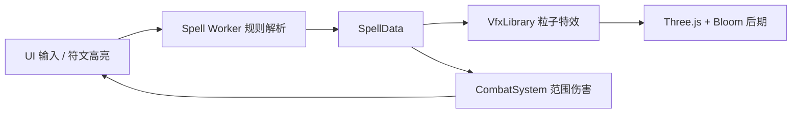

# 本项目模拟日式西幻世界观中法师吟唱施法的过程。玩家在主线程的输入框中键入咒语（如「烈焰风暴」「火球」「冰锥直线」），Web Worker 中的**规则引擎**对咒语进行解析，提取元素、粗粒度形态、威力，以及单元素时的**实体×元素×运动**三元组；主线程据此调用 Three.js 粒子特效，并在场景中执行范围伤害判定。（轻量化 LM / ONNX 为规划项，见根 [`README.md`](README.md) 路线图。）

# 魔法体系构建 Readme （可由轻量化语言模型进行解析咒文，调用对应元素方法）

## 一、核心原则

### 1.1 魔法是对法则的引用
魔法不是标准化的法术列表，而是施法者通过祷文对世界底层法则的引用。同一条法则可以被无数种祷文引用，表达方式因人而异。

### 1.2 祷文是施法者与法则之间的个人契约
- 祷文不是魔法的“说明书”，而是施法者与法则之间的**个人契约**
- 不同施法者引用同一条法则，会写出完全不同的祷文
- 别人的祷文对你而言只是一串音节，毫无魔力
- 祷文必须用**你自己的语言**去命名，承载你的理解、经历与直觉

### 1.3 真理唯一，表达无限
只要引用法则正确、结构闭合，魔力就会响应。不存在“标准祷文”，只存在“正确的结构”。

---

## 二、祷文长度与操控性

### 核心关系
祷文长度 ∝ 操控精细度
祷文长度 ∝ 施法时间

text

- **短祷文**：像按一个按钮，魔力瞬间释放，但精准度依赖施法者本能。高手可用短祷文打出精妙操作，但那是千锤百炼的结果。
- **长祷文**：像操作复杂控制台，每一步都在微调参数。代价是时间，优势是**可控性**——不需要天才本能，只需严格遵循流程。

### 结论
> 祷文越长，越容易操控；祷文越短，对施法者本能要求越高。

---

## 三、圆理之环与魔力循环

### 3.1 圆理之环的定义
圆理之环是让魔力循环回收的结构，本质是**首尾相衔的音节闭合**：
[元音] —— [祷文主体] —— [元音]

text
咏唱时观想魔力回路闭合，魔力随声音发出，又随声音回归。

### 3.2 圆理之环与祷文长度无关
- 四个词的祷文可以成环
- 四十个词的祷文也可以成环
- 只要起首元音与终结元音一致，并在咏唱时观想圆环闭合，魔力就会循环回收

### 结论
> 圆理之环决定魔耗（低），不决定长度。长祷文也可以低魔耗，只要成环。

---

## 四、低阶、中阶、高阶魔法对比

| 维度 | 低阶 | 中阶 | 高阶 |
|------|------|------|------|
| **元素** | 单一元素 | 双元素（杀伤+动力分离） | 双/多元素（深层反应） |
| **结构** | 四点闭环 | 六点闭环 | 开环多阶段 |
| **魔力** | 循环回收（低耗） | 循环回收（中耗） | 灌注消耗（高耗） |
| **威力** | 小 | 强 | 极大 |
| **范围** | 点/单体 | 单体/小范围 | 广域 |
| **施法时间** | 约2秒 | 约5-8秒 | 30秒以上 |
| **操控性** | 粗放 | 精细 | 极致精确 |
| **瞄准方式** | 施法者自身投掷 | 副元素导向/推进 | 法则锁定 |

---

## 五、各阶魔法结构模板

### 5.1 低阶魔法（四点闭环）
[元音] —— [主体] · [媒介] · [目标] · [作用] —— [元音]

text

**锚定点说明**：
| 锚点 | 含义 |
|------|------|
| 主体 | 魔力来源（如：吾血、吾息、吾骨） |
| 媒介 | 魔力经由何物释放（如：指尖、右臂、瞳中） |
| 目标 | 魔法作用对象（如：敌颅、敌足、伤处） |
| 作用 | 魔法产生的效果（如：贯穿、晶封、弥合） |

**范例（冰枪术）**：
I —— 吾息 · 右臂 · 敌胸 · 贯穿 —— I

text

---

### 5.2 中阶魔法（六点闭环）
[元音] —— [主元素·杀伤] · [副元素·动力] · [主体] · [媒介] · [目标] · [作用] —— [元音]

text

**锚定点说明**：
| 锚点 | 含义 |
|------|------|
| 主元素·杀伤 | 定义伤害类型、形态、命中后效果 |
| 副元素·动力 | 定义发射方式、飞行轨迹、加速度、射程 |
| 主体 | 魔力来源 |
| 媒介 | 魔力释放载体 |
| 目标 | 作用对象 |
| 作用 | 魔法效果 |

**职责分离原则**：
- 主元素专注杀伤，不参与动力
- 副元素专注动力，不参与杀伤
- 两者功能分离，结构耦合

**范例（飓风投枪）**：
I —— 霜骨 · 风脉 · 吾息 · 右臂 · 目中之敌 · 暴投 —— I

text

**同法则变体示例**：

| 变体 | 祷文 | 效果 |
|------|------|------|
| 完整版 | `I —— 霜骨 · 风脉 · 吾息 · 右臂 · 目中之敌 · 暴投 —— I` | 单体高伤 |
| 散射版 | `I —— 霜鳞 · 风啸 · 吾息 · 十指 · 前方扇面 · 千片激射 —— I` | 范围压制 |
| 连射版 | `I —— 霜钉 · 风轮 · 吾息 · 五指 · 逐一锁定 · 五连追射 —— I` | 持续追击 |

---

### 5.3 高阶魔法（开环多阶段）
第一阶段：召[主元素]成核
第二阶段：[主元素]定型
第三阶段：召[副元素]，定义接触协议
第四阶段：触发反应
第五阶段：锁定目标与收束

text

**元素配对原则**：
| 原则 | 说明 | 示例 |
|------|------|------|
| **相生** | 一者助长另一者 | 风+火（扩散燎原） |
| **相变** | 一者改变另一者形态 | 火+水（蒸爆） |
| **共栖** | 两者共存于同一载体 | 雷+水（感电传导） |
| **共生** | 两者共同孕育第三态 | 土+火（岩浆） |
| **序变** | 一者赋予另一者秩序 | 雷+铁/岩（磁化操控） |

**禁止配对**：天生对立、互相湮灭的元素（如：火+冰 → 互相抵消，不产生可控第三态）

**范例结构（暴雪之牙：冰+风）**：
1. 召水凝核 → 2. 凝水成冰，定形为锥 → 3. 召风为动，定义接触协议 → 4. 触发反应，风冰齐啸 → 5. 锁定目标与余寒收束

---

## 六、威力与范围的决定因素

威力不由祷文长度决定，不由结构决定。威力由三个变量控制：

| 变量 | 说明 |
|------|------|
| **元素的破坏性质** | 冰=贯穿冻结，雷=灼烧麻痹，岩=粉碎重压 |
| **元素反应的深度** | 表层协同 → 中层融合 → 深层质变（越深越强） |
| **祷文中的声明** | 祷文是法则的引用，你声明“贯穿”就是贯穿，声明“方圆三十步皆焚”就是广域 |

---

## 七、自由度与组合可能性

施法者可以根据战场需求，自由组合四个维度：

| 维度 | 可选范围 |
|------|----------|
| **长度** | 极短（本能依赖）↔ 长（精确操控） |
| **魔力** | 循环（闭环）↔ 灌注（开环） |
| **威力** | 小 ↔ 大 |
| **范围** | 点 ↔ 广域 |

**常见组合**：
- **短·循环·小威力**：低阶速攻，消耗战首选
- **长·循环·中威力**：中阶实用战法，反复使用
- **长·开环·极致威力**：高阶决战，一次性高消耗
- **短·开环·高耗**：紧急拼命，粗放释放魔力

---

## 八、施法者祷文示例（同一法则，不同表达）

引用法则：**冰为杀伤，风为动力**

| 施法者类型 | 祷文示例 | 特点 |
|------------|----------|------|
| 学院派 | `I —— 冰晶弹丸 · 气压差驱动 · 魔力坐标锁定 · 发射 —— I` | 精确、可复现 |
| 野法师 | `I —— 冻死人的玩意儿 · 背后那阵邪风 · 老子手指谁就干谁 —— I` | 粗粝、本能 |
| 战法师 | `I —— 冰·风·射 —— I` | 极致精简 |
| 诗性施法者 | `I —— 冬之齿 · 天之风 · 噬敌 —— I` | 意象编织 |

四种祷文天差地别，但引用同一条法则。真理不偏不倚，响应每一个真正理解它的人。

---

## 九、构建祷文：自查清单

在构建自己的祷文时，逐项确认：

1. **法则路径明确**：单元素还是双元素？杀伤与动力如何分配？
2. **元素配对正确**：是否相生/共栖？是否存在湮灭禁忌？
3. **锚定方式清晰**：以己身为锚？以媒介为锚？以神祇为锚？
4. **结构闭合**：低阶四点，中阶六点。首尾元音一致。
5. **语言是你的**：用你的词汇、你的理解、你的经历去命名。
6. **威力与范围已声明**：祷文中是否明确了破坏程度与作用范围？

---

## 十、演变与成长

- 祷文不是一成不变的，它会随着施法者的成长而演变
- 同一个施法者的同一条法则路径，可以衍生出无数变体
- 反复使用同一祷文，施法者与祷文之间会形成肌肉记忆般的默契
- 最终，最强大的施法者可能不需要出声咏唱——祷文内化，意志即法则


# STAR — Spell Caster

> 西幻风格的浏览器施法演示：**自然语言咒语 → Web Worker 解析 → Three.js 粒子特效 → 范围伤害判定**。

STAR 仓库当前以子项目 [`spell-caster/`](spell-caster/) 为主，实现「吟唱输入 → 元素/形态推断 → 场景内施法」的完整可玩闭环。

---

## 项目简介

玩家在 3D 场景中输入中文咒语（如「烈焰风暴」「火球」「冰锥直线」「感电风暴」），系统在独立 **Web Worker** 中解析出元素、法术形态、威力与范围；单元素咒语进一步解析为 **MagicVfxRecipe** 三元组。主线程据此生成 **three.quarks** 粒子特效（含起点→落点弹道），并对场景中的训练假人进行球形范围伤害判定。

支持 **鸟瞰轨道相机** 与 **第一人称指针锁定** 两种视角；复合元素组合可触发预设的 **元素反应** 特效与伤害加成。



---

## 当前已完成

| 模块 | 状态 | 说明 |
|------|------|------|
| 工程脚手架 | ✅ | Vite 5 + TypeScript 6 + ESM |
| 3D 引擎 | ✅ | 场景、灯光、地面、阴影、窗口自适应 |
| 后期处理 | ✅ | `EffectComposer` + `UnrealBloomPass` |
| 双相机模式 | ✅ | `OrbitControls` 鸟瞰 / `PointerLockControls` 第一人称 |
| 咒语 Worker | ✅ | 独立线程；正则 + 复合咒语表解析（`confidence ≈ 0.35`） |
| 元素体系 | ✅ | 火 / 水 / 风 / 土 / 雷 / 冰 |
| 法术形态 | ✅ | orb / burst / rain / wall / beam / storm |
| 元素反应 | ✅ | **16** 条（15 组双元素 + 1 组三元素，见 `ReactionTable.ts`） |
| 单元素三元组 VFX | ✅ | 实体×元素×运动，396 组合 + 55 条命名法术（`vfx/magic/`） |
| 粒子特效 | ✅ | 六元素 JSON + 代码 Builder 兜底；复合反应代码预制 |
| 战斗演示 | ✅ | 3 个 Capsule 假人、距离衰减伤害、弹道延迟至落点结算 |
| UI | ✅ | Loading、符文实时高亮、施法栏、伤害飘字（GSAP）、全局 Enter 施法 |
| VFX 导出脚本 | ✅ | `npm run vfx:export` 生成 `public/vfx/*.json` |

**说明**：**ONNX 轻量模型**、**祷文结构解析**、**Web Audio 音效**、**对象池** 等尚未接入；当前 Worker **仅**使用规则引擎（`confidence ≈ 0.35`），不依赖外部模型文件。

---

## 接下来计划

按优先级工作：

1. **祷文结构（P0）**：四点/六点/开环解析、`PrayerParseResult`、`LawRegistry`（见根 [`README.md`](README.md) M1–M2）。
2. **AI 解析升级（P0）**：训练/导出 `spell_parser.onnx`，Worker 接入 ONNX Runtime Web，规则引擎作降级兜底。
3. **形态差异化特效**：多元素回退路径按 `form`（雨/墙/束/风暴等）独立粒子编排，而不只调 `scale`。
4. **音效与性能**：Web Audio；粒子对象池、Bloom 半分辨率、移动端 `devicePixelRatio` 策略。
5. **玩法扩展**：语音输入（Web Speech API）、祷文书存档、联机同步（WebRTC）等。

---

## 快速开始

### 环境要求

- **Node.js** ≥ 18（推荐 LTS）
- 现代浏览器（需 **WebGL2**；开发服务器默认端口 **5173**）

### 安装与本地运行

```bash
cd spell-caster
npm install
npm run dev
```

浏览器打开终端提示的地址（一般为 `http://localhost:5173`），等待「正在连接魔网…」加载完成后即可施法。

### 生产构建与预览

```bash
cd spell-caster
npm run build      # 输出到 spell-caster/dist/
npm run preview    # 本地预览构建产物
```

### 部署

`spell-caster/dist/` 为纯静态资源，可部署至任意静态托管：

- GitHub Pages / Cloudflare Pages / Vercel / Nginx 等
- 将站点根目录指向 `dist`，并确保 SPA 回退到 `index.html`（若使用子路径部署，需在 `vite.config.ts` 配置 `base`）

重新生成粒子 JSON（修改 `src/vfx/builders` 后）：

```bash
cd spell-caster
npm run vfx:export
```

### 操作说明

| 模式 | 操作 |
|------|------|
| 鸟瞰（默认） | 拖拽旋转、滚轮缩放；**起点=南侧高空蓝台，落点=场地中心**（固定，不随鼠标） |
| 第一人称 | 点击 HUD「第一人称」切换；点击画面锁定指针，WASD 移动，准星地面交点施法 |
| 施法 | 输入咒语后点击「施法」或按 **Enter**（全局，输入框未聚焦时也可） |

**示例咒语**：

| 类型 | 示例 |
|------|------|
| 单元素 | `火`、`火球`、`冰锥直线`、`旋风旋转`、`水环定点`、`雷束` |
| 多元素反应 | `烈焰风暴`、`感电风暴`、`熔岩喷发`、`雷火旋风`（三元素） |

---

## 目录结构

```
STAR/
├── README.md                 # 魔法体系总览 + Demo 进度
├── Introduce.md              # 本文件（世界观 + Demo 说明）
├── spell-caster.md           # 技术架构与数据流
├── HISTORY.md                # 世界观设定「万律之音」
├── LICENSE
└── spell-caster/             # 可运行应用
    ├── index.html
    ├── package.json
    ├── public/vfx/           # 单元素 JSON + reactions/
    ├── scripts/export-vfx.ts
    └── src/
        ├── main.ts
        ├── types.ts
        ├── worker/spell.worker.ts
        ├── core/             # Engine, SpellCaster, CameraController
        ├── combat/
        ├── effects/
        ├── ui/
        └── vfx/
            ├── magic/        # ★ 三元组魔法管线
            ├── modules/
            ├── recipes/
            ├── builders/
            └── reactions/
```

---

## 开源协议

本项目采用 **[MIT License](https://opensource.org/licenses/MIT)**，全文见根目录 [`LICENSE`](LICENSE)。

各依赖库遵循其各自许可证（见下表）。

---

## 第三方库与项目

| 名称 | 版本（约） | 用途 | 许可证 |
|------|------------|------|--------|
| [Vite](https://vitejs.dev/) | ^5.4 | 构建与开发服务器 | MIT |
| [TypeScript](https://www.typescriptlang.org/) | ~6.0 | 类型检查 | Apache-2.0 |
| [Three.js](https://threejs.org/) | ^0.184 | WebGL 渲染、后期、控制器 | MIT |
| [three.quarks](https://github.com/Alchemist0823/three.quarks) | ^0.17 | 粒子系统与 `BatchedRenderer` | MIT |
| [quarks.core](https://github.com/Alchemist0823/three.quarks) | 0.17（传递依赖） | 发射器、曲线、粒子核心 | MIT |
| [GSAP](https://gsap.com/) | ^3.15 | 伤害数字动画 | 标准许可（免费使用需遵守其许可条款） |
| [tsx](https://github.com/privatenumber/tsx) | ^4.22 | 运行 VFX 导出脚本 | MIT |
| [@types/three](https://www.npmjs.com/package/@types/three) | ^0.184 | Three.js 类型定义 | MIT |

Three.js 示例模块（随 `three` 分发）：`OrbitControls`、`PointerLockControls`、`EffectComposer`、`RenderPass`、`UnrealBloomPass`。

---

## 致谢

感谢以下开源项目与社区，使本演示得以快速实现高质量的 3D 与粒子效果：

- **[Three.js](https://threejs.org/)** 团队与贡献者 — 浏览器 3D 的事实标准。
- **[three.quarks](https://github.com/Alchemist0823/three.quarks) / [quarks.core](https://github.com/Alchemist0823/three.quarks)**（Alchemist0823 等）— 高性能粒子与批渲染管线。
- **[Vite](https://vitejs.dev/)** — 极速开发与原生 Web Worker 支持。
- **[GSAP](https://gsap.com/)** — 流畅的 UI 动效。
- 元素反应与RPG施法玩法的设计灵感，借鉴自常见 RPG 思路（仅作演示，非商业产品）。

若你在使用或二次开发本项目，欢迎 Star、Issue 或 PR。

---

## 相关文档

| 文档 | 内容 |
|------|------|
| [`README.md`](README.md) | 魔法体系设计、实现进度、路线图 |
| [`spell-caster.md`](spell-caster.md) | 技术架构、数据流、类型定义 |
| [`HISTORY.md`](HISTORY.md) | 世界观设定「万律之音」 |
| [`spell-caster/package.json`](spell-caster/package.json) | 脚本与依赖版本 |