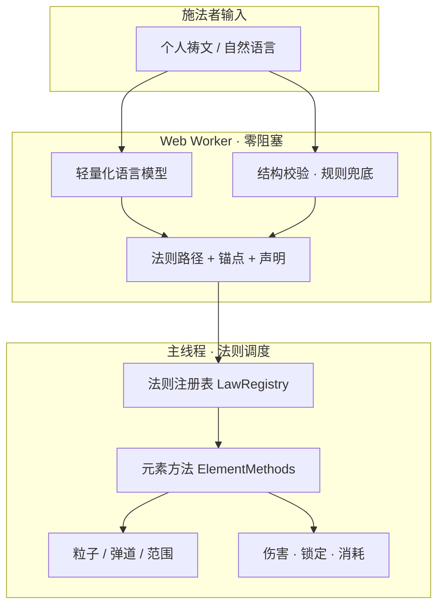
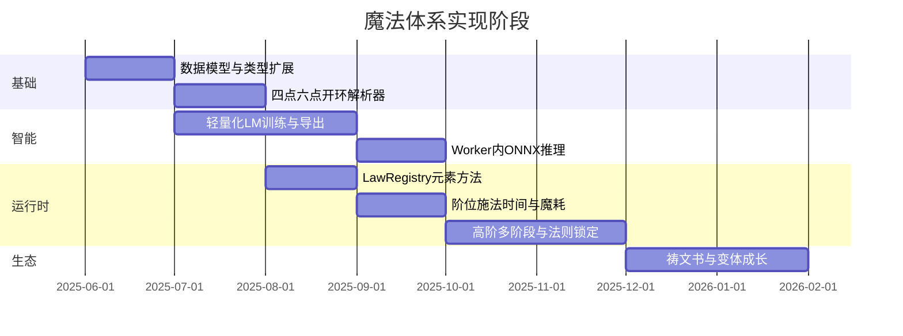

# STAR — Ritual Incantation Engine

"A spell crafting engine where players compose magic through procedural incantations — not preset spells. Each spell is built from combinatorial elements (entity × element × motion) parsed from natural language input, producing emergent magical effects in the browser."

Low-tier: 4-anchor closed ring | Mid-tier: 6-anchor dual element | High-tier: Open loop stages

# STAR — 魔法体系引擎

> **最终目标**：构建一套可由**轻量化语言模型**解析的个人祷文系统——祷文引用底层法则，运行时调用对应**元素方法**（特效、弹道、伤害、范围），在浏览器中完成可玩的 3D 施法闭环。

当前仓库以 [`spell-caster/`](spell-caster/) 为**技术验证 Demo**：已实现元素反应、粒子特效与战斗判定的骨架；祷文结构、圆理之环、阶位与 LM 解析仍按下文路线图推进。

---

## 愿景一句话

魔法不是固定技能表，而是施法者用**自己的语言**对世界法则的引用；**真理唯一，表达无限**——结构正确且闭合，魔力即响应。



---

## 一、核心原则（设计宪法）

| 原则 | 含义 | 系统 implication |
|------|------|------------------|
| **魔法 = 对法则的引用** | 同一条法则可被无数祷文表达 | 解析输出 `LawRef`，而非固定 `skillId` |
| **祷文 = 个人契约** | 他人祷文对你无魔力；须用自己的词汇 | 支持玩家自定义锚点名；LM 提取语义槽位，不强制标准咒语 |
| **真理唯一，表达无限** | 结构闭合即可，无「官方祷文」 | 校验**结构**（阶位、锚点、成环），不校验措辞 |
| **长度 ↔ 操控性** | 短祷文快而靠本能；长祷文慢而可控 | `castTime`、`controlPrecision` 与文本长度/锚点数挂钩 |
| **圆理之环 ↔ 魔耗** | `[元音]…[元音]` 首尾一致则循环回收 | `ringClosed` 决定 `manaCost` 档位，与长度无关 |
| **威力三变量** | 元素性质 × 反应深度 × 祷文声明 | `damage`、`radius`、`effectTags` 由声明与反应表推导，不由字数直接决定 |

---

## 二、圆理之环与魔力循环

咏唱结构：

```text
[元音] —— [祷文主体] —— [元音]
```

- **成环**：起首元音 = 终结元音，且咏唱时观想回路闭合 → **循环回收、低魔耗**（低/中阶默认）。
- **开环**：高阶多阶段、灌注式释放 → **高魔耗、高威力**，不强制首尾元音一致。

| 属性 | 闭环（圆理之环） | 开环（灌注） |
|------|------------------|--------------|
| 魔耗 | 低～中 | 高 |
| 典型阶位 | 低阶、中阶 | 高阶 |
| 实现字段（规划） | `ringClosed: true`, `vowelKey` | `ringClosed: false`, `stages[]` |

---

## 三、阶位与结构模板

### 3.1 三阶对比

| 维度 | 低阶 | 中阶 | 高阶 |
|------|------|------|------|
| **元素** | 单一 | 双元素（杀伤 + 动力分离） | 双/多元素深层反应 |
| **结构** | 四点闭环 | 六点闭环 | 开环多阶段 |
| **魔力** | 循环回收 | 循环回收 | 灌注消耗 |
| **威力** | 小 | 强 | 极大 |
| **范围** | 点/单体 | 单体/小范围 | 广域 |
| **施法时间** | ~2s | ~5–8s | 30s+ |
| **操控** | 粗放（自身投掷） | 精细（副元素导向） | 极致（法则锁定） |

### 3.2 低阶 · 四点闭环

```text
[元音] —— [主体] · [媒介] · [目标] · [作用] —— [元音]
```

| 锚点 | 含义 | 示例 |
|------|------|------|
| 主体 | 魔力来源 | 吾息、吾血 |
| 媒介 | 释放载体 | 右臂、指尖 |
| 目标 | 作用对象 | 敌胸、伤处 |
| 作用 | 效果声明 | 贯穿、晶封 |

**范例**：`I —— 吾息 · 右臂 · 敌胸 · 贯穿 —— I`（冰枪术法则路径）

### 3.3 中阶 · 六点闭环

```text
[元音] —— [主元素·杀伤] · [副元素·动力] · [主体] · [媒介] · [目标] · [作用] —— [元音]
```

- **主元素**：只定义伤害类型、形态、命中效果（不参与动力）。
- **副元素**：只定义发射方式、轨迹、加速度、射程（不参与杀伤）。

**范例**：`I —— 霜骨 · 风脉 · 吾息 · 右臂 · 目中之敌 · 暴投 —— I`（飓风投枪）

同法则变体（散射 / 连射）仅更换锚点与声明，共用一条 `LawRef`。

### 3.4 高阶 · 开环多阶段

典型五阶段：成核 → 定型 → 召副元素/接触协议 → 触发反应 → 锁定收束。

**元素配对**（允许）：相生、相变、共栖、共生、序变。  
**禁止**：天生对立、互相湮灭（如 **火 + 冰** 直接抵消，不产生可控第三态）。

---

## 四、威力、范围与四维组合

威力由以下决定，**不由祷文长度或模板点数单独决定**：

| 变量 | 说明 |
|------|------|
| 元素破坏性质 | 冰→贯穿冻结，雷→麻痹，岩→重压 |
| 元素反应深度 | 表层协同 → 中层融合 → 深层质变 |
| 祷文声明 | 「贯穿」「方圆三十步皆焚」等自然语言承诺 |

施法者可自由组合：

| 长度 | 魔力模式 | 威力 | 范围 | 典型用途 |
|------|----------|------|------|----------|
| 短 | 循环 | 小 | 点 | 低阶速攻 |
| 长 | 循环 | 中 | 小范围 | 中阶战法 |
| 长 | 开环 | 大 | 广域 | 高阶决战 |
| 短 | 开环 | 高耗 | 不定 | 紧急拼命 |

---

## 五、同一法则，不同表达（LM 解析目标）

引用法则：**冰为杀伤，风为动力**

| 类型 | 祷文示例 |
|------|----------|
| 学院派 | `I —— 冰晶弹丸 · 气压差驱动 · 魔力坐标锁定 · 发射 —— I` |
| 野法师 | `I —— 冻死人的玩意儿 · 背后那阵邪风 · 老子手指谁就干谁 —— I` |
| 战法师 | `I —— 冰·风·射 —— I` |
| 诗性 | `I —— 冬之齿 · 天之风 · 噬敌 —— I` |

解析器输出相同的 `LawRef` + 填充后的锚点槽位，再调度同一套元素方法；差异体现在 `castTime`、`confidence` 与可选的本能加成（后期玩法）。

**构建自查清单**（解析与 UI 校验用）：

1. 法则路径：单元素 / 双元素？杀伤与动力是否分离？  
2. 元素配对：相生/共栖？是否触犯湮灭禁忌？  
3. 锚定方式：己身 / 媒介 / 神祇？  
4. 结构闭合：低四锚、中六锚；首尾元音一致？  
5. 语言个人化：槽位由玩家词汇填充，非固定技能名。  
6. 威力与范围：声明中是否明确破坏程度与作用范围？

---

## 六、目标代码架构（规划）

与 [`spell-caster/`](spell-caster/) 演进对照：

```
spell-caster/src/
├── types.ts                 # SpellData → PrayerParseResult（阶位、锚点、成环、声明）
├── worker/
│   ├── spell.worker.ts      # 入口：LM 推理 + 规则兜底
│   ├── prayerParser.ts      # 结构识别：四点 / 六点 / 开环阶段
│   └── lawMatcher.ts        # 法则路径 → LawRef
├── law/
│   ├── LawRegistry.ts       # 法则注册表
│   └── elementMethods/      # fire(), ice(), windKinetic() …
├── vfx/                     # 已有：按元素 + 反应调度（对接 elementMethods）
├── combat/                  # 已有：范围伤害 → 扩展锁定/阶段伤害
└── grimoire/                # 祷文存档、变体、成长（后期）
```

**规划中的核心类型**（摘录）：

```typescript
type PrayerTier = 'low' | 'mid' | 'high';
type StructureKind = 'closed4' | 'closed6' | 'openStages';

interface PrayerParseResult {
  tier: PrayerTier;
  structure: StructureKind;
  ringClosed: boolean;
  vowelKey?: string;           // 圆理之环元音
  elements: { kill?: Element; kinetic?: Element; aux?: Element[] };
  anchors: Record<string, string>; // 主体/媒介/目标/作用 等槽位
  declarations: string[];      // 贯穿、暴投、广域焚毁…
  lawRef: string;              // 如 "ice.kill+wind.kinetic"
  castTimeMs: number;
  manaCost: number;
  confidence: number;
}
```

---

## 七、当前实现进度

### 7.1 已完成（Demo 骨架）

| 能力 | 状态 | 与目标体系的关系 |
|------|------|------------------|
| Web Worker 隔离解析 | ✅ | 将升级为 LM + 结构校验管线 |
| 六元素 + 关键词提取 | ✅ | 对应法则中的元素语义，未分杀伤/动力 |
| **单元素三元组特效** | ✅ | **实体 × 元素 × 运动**，288 组合可施放 |
| **咒语驱动实体/运动** | ✅ | 非「火→火球」硬编码；命名法术 + 关键词解析 |
| 元素反应表（**15** 种双/三元素） | ✅ | 配方化模块组装 + 代码预制 |
| 粒子模块配方 `VfxRecipe` | ✅ | 反应/形态层叠；与三元组魔法管线并存 |
| three.quarks 粒子 + Bloom | ✅ | `BatchedRenderer` 批渲染 |
| 范围伤害 + 假人 | ✅ | 弹道类延迟至落点结算 |
| 双相机 + 第一人称施法 | ✅ | 鸟瞰固定起点/落点，便于观察弹道 |
| 全局回车确认施法 | ✅ | 输入框未聚焦时也可施法 |
| 规则引擎兜底 | ✅ | 保留为 LM 离线/低置信度时的 fallback |

### 7.1.1 单元素魔法特效（已实现）

魔法视觉由咒语解析为三元组，再合成粒子与运动：

```text
咒语 → MagicVfxRecipe { entity, element, motion }
     → buildMagicBody（元素×实体外观）
     → MagicVfxEffect（起点 → 目标落点）
```

| 维度 | 可选值 | 说明 |
|------|--------|------|
| **实体** | `sphere` `cone` `ring` `column` `disk` `beam` `fluid` `cloud` | 发射器几何 |
| **元素** | 火水冰风土雷 | 颜色、材质、副粒子层 |
| **运动** | `linear` `parabolic` `curve` `rotate` `stationary` `fallFromAbove` | 直线/抛物/曲线/旋转/定点/下落 |

- **全矩阵**：6 × 8 × 6 = **288** 种组合（`buildSingleElementMatrix()`）
- **仅念元素**时的默认（非火球）：火/水→流体直线，冰→锥直线，风→柱旋转，土→盘定点，雷→束直线
- **命名法术** 40+ 条：如火球、冰锥、旋风、雷束、暴雨、岩环定点等（见 `elementCatalog.ts`）

**鸟瞰观察模式**：起点固定南侧高空 `(0, 9.5, -16)`，落点固定场地中心 `(0, 0, 0)`，场景有蓝台标记与弹道示意线。

**第一人称**：起点≈相机，落点=准星地面交点。

### 7.2 尚未实现（相对目标体系）

| 能力 | 优先级 |
|------|--------|
| 轻量化 LM（ONNX / 本地小模型）解析锚点与声明 | P0 |
| 四点 / 六点 / 开环结构识别与校验 | P0 |
| 圆理之环检测（元音首尾、魔耗模型） | P1 |
| 中阶杀伤/动力元素职责分离 | P0 |
| 高阶多阶段咏唱与进度条 / 打断 | P1 |
| `LawRegistry` + `elementMethods` 显式调度 | P0 |
| 禁止配对（火+冰湮灭）与反应深度分级 | P1 |
| 施法时间、魔耗、法则锁定瞄准 | P1 |
| 个人祷文书 / 变体衍生 / 成长 | P2 |
| 语音咏唱、联机同步 | P3 |

---

## 八、路线图



| 阶段 | 交付物 | 验收标准 |
|------|--------|----------|
| **M1 祷文结构** | `PrayerParseResult`、结构校验器 | 输入六点范例 → 正确识别杀伤/动力/锚点；违例成环报错 |
| **M2 法则调度** | `LawRegistry`、`elementMethods` | 同一 `LawRef` 下四种文风祷文调用同一套效果 |
| **M3 LM 解析** | ONNX 模型 + Worker | 野法师口语 → 槽位填充正确；置信度低时规则兜底 |
| **M4 阶位行为** | 咏唱计时、魔耗、瞄准模式 | 低/中/高阶施法时间与消耗符合上表 |
| **M5 高阶开环** | 多阶段 UI + 分阶段特效 | 「暴雪之牙」五阶段可完整演练 |
| **M6 成长生态** | 祷文存档、变体、熟练度 | 同一法则可保存多个个人变体 |

技术栈与工程细节见 [`spell-caster.md`](spell-caster.md)（Vite、Three.js、Worker、ONNX 规划等）。

---

## 九、快速开始（当前 Demo）

### 环境要求

- **Node.js** ≥ 18  
- 支持 **WebGL2** 的现代浏览器  

### 安装与运行

```bash
cd spell-caster
npm install
npm run dev
```

访问 `http://localhost:5173`，待 Loading 结束后在输入框施法。

### 构建与部署

```bash
cd spell-caster
npm run build
npm run preview
```

将 `spell-caster/dist/` 部署至任意静态托管即可。修改粒子预制后执行 `npm run vfx:export`。

### 当前 Demo 操作

| 模式 | 操作 |
|------|------|
| 鸟瞰 | 拖拽旋转、滚轮缩放；**起点=南侧高空蓝台，落点=场地中心** |
| 第一人称 | HUD 切换；点击画面锁定指针，WASD 移动，准星落点施法 |
| 施法 | 输入咒语 → **Enter**（全局）或点击「施法」 |

**单元素示例**（实体+运动由咒语指定）：

| 咒语 | 三元组 |
|------|--------|
| `火` | 火·流体·直线 |
| `火球` | 火·球体·抛物 |
| `冰锥` / `冰锥直线` | 冰·锥形·直线 |
| `旋风旋转` | 风·柱·旋转 |
| `水环定点` | 水·环·定点 |
| `雷束` | 雷·束·直线 |
| `球形土抛物` | 土·球体·抛物 |

**多元素反应示例**：`烈焰风暴`、`感电风暴`、`熔岩喷发`、`雷火旋风`、`泥沼洪流`、`风雷裂空`

> 六点闭环范例（体系验证用，解析器待实现）：  
> `I —— 霜骨 · 风脉 · 吾息 · 右臂 · 目中之敌 · 暴投 —— I`

---

## 十、仓库结构

```
STAR/
├── README.md
├── spell-caster.md
└── spell-caster/
    ├── src/
    │   ├── worker/spell.worker.ts     # 规则解析 + magic 三元组
    │   ├── vfx/
    │   │   ├── magic/                 # 实体×元素×运动（核心）
    │   │   ├── modules/               # 可叠层粒子模块
    │   │   ├── recipes/               # 反应/形态配方
    │   │   ├── builders/              # Quarks 预制与导出
    │   │   └── reactions/             # 15 种元素反应表
    │   ├── core/                      # Engine、相机、施法落点
    │   ├── combat/
    │   └── ui/
    ├── public/vfx/                    # 单元素 JSON + reactions/
    └── scripts/export-vfx.ts          # npm run vfx:export
```

---

## 十一、开源协议

本项目采用 **[MIT License](https://opensource.org/licenses/MIT)**。对外发布前建议在根目录添加 `LICENSE` 全文。

---

## 十二、第三方依赖

| 名称 | 用途 | 许可证 |
|------|------|--------|
| [Vite](https://vitejs.dev/) | 构建、HMR、Worker | MIT |
| [TypeScript](https://www.typescriptlang.org/) | 类型安全 | Apache-2.0 |
| [Three.js](https://threejs.org/) | 渲染、后期、控制器 | MIT |
| [three.quarks](https://github.com/Alchemist0823/three.quarks) / [quarks.core](https://github.com/Alchemist0823/three.quarks) | 粒子系统 | MIT |
| [GSAP](https://gsap.com/) | UI 动效 | 见官方许可 |
| [tsx](https://github.com/privatenumber/tsx) | 脚本执行 | MIT |

**规划引入**：ONNX Runtime Web（轻量咒文解析模型）。

---

## 十三、致谢

- **[Three.js](https://threejs.org/)** — 3D 运行时基础。  
- **[three.quarks](https://github.com/Alchemist0823/three.quarks)** — 高性能粒子与批渲染。  
- **[Vite](https://vitejs.dev/)** — 开发体验与 Web Worker 原生支持。  
- **[GSAP](https://gsap.com/)** — 伤害飘字与 UI 动画。  
- 魔法体系世界观与祷文结构由本项目独立设计；元素反应玩法借鉴常见 RPG 思路，仅作技术演示。

欢迎 Star、Issue 与 PR，尤其是 **祷文解析**、**法则注册表** 与 **元素方法** 相关贡献。

---

## 相关文档

| 文档 | 内容 |
|------|------|
| [`spell-caster.md`](spell-caster.md) | 技术架构、数据流、ONNX 与性能 |
| [`spell-caster/package.json`](spell-caster/package.json) | 脚本与依赖版本 |
