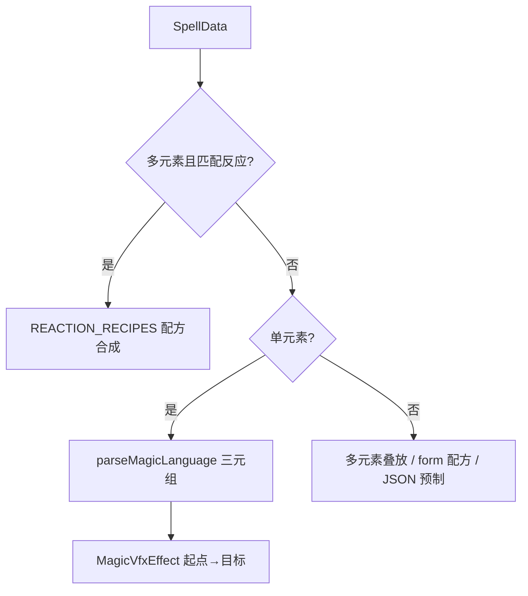

# Spell Caster — 魔法咒文系统

> 基于浏览器的单机 Demo：咒语 → Web Worker 规则解析 → **实体×元素×运动** 粒子特效 + 元素反应 + 范围伤害。

---

## 项目概述

玩家输入自然语言咒语，Worker 解析**元素**、粗粒度 `form`、威力，以及单元素时的 **`MagicVfxRecipe`（实体 + 运动）**。主线程用 three.quarks 生成粒子，按运动配方从**施法起点**飞向**目标落点**，命中后结算伤害。

当前解析为**规则引擎**（关键词 + 命名法术表）；ONNX 为规划项。

核心设计目标：
- **主线程零阻塞**：解析在 Web Worker
- **三元组组装魔法**：`entity × element × motion`，396 种单元素组合（6×11×6）
- **咒语驱动**：显式写「球体」「抛物」「锥形」等，避免仅「火」就当成火球
- **元素反应**：16 条反应定义（15 组双元素 + 1 组三元素）配方化复合特效
- **视觉**：three.quarks + `UnrealBloomPass`

---

## 技术架构

```
┌─────────────────────────────────────────────────────────┐
│                        主线程 (Main Thread)              │
│  ┌──────────────┐  ┌──────────────┐  ┌──────────────┐  │
│  │   UI 输入层   │  │  3D 特效系统  │  │  战斗判定系统 │  │
│  │ ·咒语输入框   │  │ ·粒子发射器   │  │ ·球形范围检测 │  │
│  │ ·符文实时反馈 │  │ ·Shader 材质 │  │ ·伤害计算     │  │
│  │ ·伤害数字飘字 │  │ ·后期辉光    │  │ ·目标受击动画 │  │
│  └──────┬───────┘  └──────▲───────┘  └──────▲───────┘  │
│         │                 │                  │          │
│         │    SpellData    │                  │          │
│         └─────────────────┴──────────────────┘          │
│                          │                              │
│  ┌───────────────────────┴───────────────────────────┐  │
│  │              通信层 (Structured Clone)             │  │
│  └───────────────────────┬───────────────────────────┘  │
└──────────────────────────┼──────────────────────────────┘
                           │
┌──────────────────────────┼──────────────────────────────┐
│                          ▼                              │
│  ┌─────────────────────────────────────────────────┐   │
│  │           Web Worker (Spell Worker)              │   │
│  │                                                  │   │
│  │  输入文本 → 元素/形态关键词 → parseMagicLanguage   │   │
│  │                                                  │   │
│  │  输出: SpellData + magic?: MagicVfxRecipe        │   │
│  │                                                  │   │
│  │  （规划）ONNX 推理 + 规则兜底                     │   │
│  └─────────────────────────────────────────────────┘   │
└─────────────────────────────────────────────────────────┘
```

---

## 技术选型

| 层级 | 技术 | 选型理由 |
|------|------|----------|
| 构建工具 | **Vite** | 原生支持 Web Worker (`?worker` 导入)、HMR、极速冷启动 |
| 语言 | **TypeScript** | 主线程与 Worker 间通信的类型安全 |
| 3D 渲染 | **Three.js r160+** | 浏览器 3D 标准，粒子系统与 ShaderMaterial 成熟，后期处理链完善 |
| 粒子 | **three.quarks** + quarks.core | 批渲染粒子、预制导出 JSON |
| AI 推理（规划） | **ONNX Runtime Web** | 短文本分类；当前为规则引擎 |
| 并发 | **原生 Web Worker** | Vite 原生支持，零配置隔离计算线程 |
| 音效 | **Web Audio API** | 原生支持，根据 potency 实时调整音高/混响，零依赖 |
| UI 动画 | **GSAP** (可选) | 伤害数字弹跳、符文汇聚时序控制 |
| 后期处理 | **UnrealBloomPass** | 法术能量感核心，加法混合发光效果 |

---

## 项目结构

```
spell-caster/
├── src/
│   ├── main.ts
│   ├── types.ts                   # SpellData、MagicVfxRecipe、Worker 协议
│   ├── worker/
│   │   └── spell.worker.ts        # 规则解析 + 单元素 magic 三元组
│   ├── core/
│   │   ├── Engine.ts              # 场景、相机、施法起点/落点、Bloom
│   │   ├── CameraController.ts    # 鸟瞰 / 第一人称、ORBIT_CAST_* 常量
│   │   └── SpellCaster.ts         # 调度 VFX + 战斗 + 命中爆发
│   ├── vfx/
│   │   ├── magic/                 # ★ 单元素核心
│   │   │   ├── types.ts           # entity / motion / MagicVfxRecipe
│   │   │   ├── parseMagicLanguage.ts
│   │   │   ├── elementCatalog.ts  # 默认表、命名法术、396 矩阵
│   │   │   ├── elementBodyVariants.ts
│   │   │   ├── buildMagicBody.ts
│   │   │   ├── buildMagicImpact.ts
│   │   │   ├── MagicVfxEffect.ts  # 起点→目标运动
│   │   │   └── MagicVfxComposer.ts
│   │   ├── modules/               # VfxModuleRegistry（反应叠层）
│   │   ├── recipes/               # reactionRecipes、elementFormRecipes
│   │   ├── builders/              # 六元素 + 复合 Quarks 预制
│   │   ├── reactions/ReactionTable.ts
│   │   ├── VfxLibrary.ts
│   │   └── VfxComposer.ts
│   ├── effects/
│   │   ├── BaseEffect.ts
│   │   ├── effectFactory.ts
│   │   └── QuarksSpellEffect.ts
│   ├── combat/CombatSystem.ts
│   └── ui/UIManager.ts
├── public/vfx/                    # fire.json … + reactions/*.json
├── scripts/export-vfx.ts          # npm run vfx:export
├── index.html
└── package.json
```

---

## 核心数据流

### 1. 初始化阶段（首屏加载）

```
用户打开页面
    │
    ▼
┌─────────────────┐
│ 显示 Loading UI │  "正在连接魔网..."
│ 符文逐个亮起动画 │
└────────┬────────┘
         │
    ┌────┴────┐
    ▼         ▼
┌───────┐  ┌──────────────┐
│ Worker│  │ Three.js 场景 │
│ init  │  │ 初始化        │
│       │  │ 灯光/地面/相机 │
└───┬───┘  └──────────────┘
    │
    ▼
Worker → Main: { type: 'ready' }
    │
    ▼
隐藏 Loading，显示输入框
```

### 2. 施法阶段（运行时）

```
用户输入 "烈焰风暴"
    │
    ▼
UIManager: 实时高亮 "火" "风" 符文
    │
    ▼
用户点击施法 / 按回车
    │
    ▼
Main → Worker: { type: 'parse', text: '烈焰风暴' }
    │
    ▼
Worker 内部:
  ├─ parseByRules（元素 / form / potency）
  ├─ 单元素 → parseMagicLanguage → MagicVfxRecipe
  ├─ 数值围栏（Clamp、长度上限）
  └─ 输出 SpellData（confidence ≈ 0.35）

  （规划）ONNX 推理 → 高置信度结果；低置信度时规则兜底
    │
    ▼
Worker → Main: { type: 'spell', payload: SpellData }
    │
    ▼
SpellCaster 调度:
  ├─ origin = getCastOrigin(target), target = getCastPosition()
  ├─ 单元素 → MagicVfxEffect（三元组 + 起点→目标）
  ├─ 多元素反应 → ReactionTable + composeVfx
  ├─ 弹道命中 → spawnMagicImpact + 范围伤害
  └─ UIManager 飘字 + 三元组标签
    │
    ▼
渲染循环: EffectComposer → UnrealBloomPass → 屏幕输出
```

---

## 核心类型定义

```typescript
// src/types.ts

/** 法术元素类型 */
export type ElementType = 'fire' | 'water' | 'wind' | 'earth' | 'thunder' | 'ice';

/** 法术形态类型 */
export type FormType = 'orb' | 'burst' | 'rain' | 'wall' | 'beam' | 'storm';

/** Worker 解析输出 */
export interface SpellData {
  elems: ElementType[];
  form: FormType;           // 粗粒度形态（伤害半径推断；非三元组实体）
  potency: number;
  radius: number;
  damage: number;
  confidence: number;
  /** 单元素：实体 × 元素 × 运动（Worker 内 parseMagicLanguage） */
  magic?: MagicVfxRecipe;
}

interface MagicVfxRecipe {
  entity: VfxEntityType;    // sphere | cone | ring | column | disk | beam | fluid | cloud
  element: ElementType;
  motion: VfxMotionType;    // linear | parabolic | curve | rotate | stationary | fallFromAbove
  label?: string;
}

/** Worker 通信协议 */
export type WorkerRequest =
  | { type: 'init' }
  | { type: 'parse'; text: string };

export type WorkerResponse =
  | { type: 'ready' }
  | { type: 'spell'; payload: SpellData }
  | { type: 'error'; message: string };

/** 元素反应表条目 */
export interface ReactionEntry {
  /** 反应名称 */
  name: string;
  /** 视觉特效类名 */
  visualClass: string;
  /** 伤害类型组合 */
  damageTypes: string[];
  /** Shader 混合模式 */
  blendMode: 'additive' | 'normal' | 'multiply';
  /** 粒子生命周期倍率 */
  lifeMultiplier: number;
}
```

---

## 特效系统架构

### 调度优先级（`VfxLibrary.spawnSpell`）



### 单元素：实体 × 元素 × 运动

```typescript
interface MagicVfxRecipe {
  entity: 'sphere' | 'cone' | 'ring' | 'column' | 'disk' | 'beam' | 'fluid' | 'cloud'
        | 'barrier' | 'burst' | 'shatter';
  element: 'fire' | 'water' | 'ice' | 'wind' | 'earth' | 'thunder';
  motion: 'linear' | 'parabolic' | 'curve' | 'rotate' | 'stationary' | 'fallFromAbove';
  label?: string;
}
```

全矩阵：**6 × 11 × 6 = 396**（`buildSingleElementMatrix()`）；命名法术 **55** 条（`NAMED_SPELLS`）。

| 运动 | 行为 | 伤害结算 |
|------|------|----------|
| `linear` / `parabolic` / `curve` | 从 `origin` 飞向 `target` | 抵达落点 |
| `rotate` / `stationary` | 在 `target` 展开 | 施法时 |
| `fallFromAbove` | 目标上方下落 | 落地时 |

**解析**（`parseMagicLanguage.ts`）：

1. `NAMED_SPELLS`（`elementCatalog.ts`）— 火球、冰锥、旋风等  
2. 咒语中的实体词（锥、球、柱、环…）与运动词（直线、抛物、旋转…）  
3. 仅元素名 → `ELEMENT_DEFAULT_RECIPE`（如火=流体直线，非火球）

**外观**（`buildMagicBody.ts` + `elementBodyVariants.ts`）：元素×实体外观参数表 + 副层（火星/水滴/冰屑/气流…）。

**命中**（`buildMagicImpact.ts`）：弹道抵达时额外爆发粒子。

### 施法坐标

| 模式 | 起点 `getCastOrigin` | 落点 `getCastPosition` |
|------|----------------------|-------------------------|
| 鸟瞰 | `ORBIT_CAST_ORIGIN` (0, 9.5, -16) 南侧高空 | `ORBIT_CAST_CENTER` (0,0,0) |
| 第一人称 | 相机略低 | 准星射线与地面交点 |

### 元素反应（16 条）

双元素全覆盖（C(6,2)=15），另含三元素 `fire+wind+thunder`。配方在 `recipes/reactionRecipes.ts`，由 `VfxModuleRegistry` 叠层，`VfxComposer.composeVfx` 合成。

> **与目标体系差异**：目标高阶禁止火+冰湮灭配对；Demo 中 `fire+ice` 已实现为「冰火消融」反应，供 RPG 演示。

示例：`fire+wind` 烈焰旋风、`water+earth` 泥沼洪流、`ice+thunder` 冰雷碎击。

### 模块配方层（与三元组并存）

`src/vfx/modules/` + `recipes/`：反应特效与旧版 `form`（orb/rain/storm…）单元素形态配方，在**未走 magic 管线**时作为回退。

---

## AI 模型设计（规划，尚未实现）

当前 Worker 使用 `parseByRules` 规则引擎；以下为目标 ONNX 方案。

### 模型定位

非 LLM，而是**轻量序列分类模型**，专门处理短文本多标签分类：

- **输入**：玩家咒语文本（10~30 字）
- **输出**：元素标签概率分布 + 形态分类 + 威力回归
- **架构**：2层 BiLSTM + Attention 或 TextCNN
- **导出**：PyTorch → ONNX（动态轴支持变长输入）

### 训练数据示例

| 咒语文本 | elems | form | potency |
|----------|-------|------|---------|
| "火球术" | [fire] | orb | 2 |
| "烈焰风暴" | [fire, wind] | storm | 4 |
| "冰霜之雨" | [water, ice] | rain | 3 |
| "大地守护墙" | [earth] | wall | 2 |
| "雷霆万钧" | [thunder, wind] | burst | 5 |

### 推理流程

```
文本分词 → Embedding → BiLSTM → 
  ├─ [元素分类头] → sigmoid → 多标签概率
  ├─ [形态分类头] → softmax → form 类型
  └─ [威力回归头] → relu → potency 值 (1~5)
```

### 当前解析（规则引擎）

`spell.worker.ts` → `parseByRules`：元素、形态、威力；单元素时附加 `parseMagicLanguage(text, element)`。

```typescript
// 仅「火」→ 非火球
{ entity: 'fluid', element: 'fire', motion: 'linear', label: '火流体·直线' }

// 「火球」→ 命名表
{ entity: 'sphere', element: 'fire', motion: 'parabolic', label: '火球' }
```

扩展命名法术：编辑 `src/vfx/magic/elementCatalog.ts` 的 `NAMED_SPELLS`。

---

## 性能优化策略

| 层面 | 策略 | 状态 |
|------|------|------|
| **加载** | VFX JSON 预加载 | ✅ 已实现 |
| **加载** | ONNX 模型 + 音效资源预加载 | 规划中 |
| **Worker** | 单例模型，推理复用 Session | 规划中（当前规则解析 <1ms） |
| **渲染** | 对象池复用粒子系统 | 规划中 |
| **后期** | Bloom 分辨率降级（0.5x） | 规划中 |
| **内存** | `BaseEffect.dispose()` 显式释放 | ✅ 已实现 |

---

## 开发里程碑

| 阶段 | 目标 | 状态 |
|------|------|------|
| **M0** | 环境搭建 | ✅ |
| **M1** | Worker 通信 + SpellData | ✅ |
| **M2** | three.quarks 粒子 + Bloom | ✅ |
| **M3** | 端到端施法闭环 | ✅ |
| **M4** | 元素反应（16 条）+ 模块配方 | ✅ |
| **M5** | 战斗 + 飘字 + 双相机 | ✅ |
| **M6** | 单元素三元组 + 396 矩阵 + 弹道 | ✅ |
| **M7** | ONNX / 祷文结构 / LawRegistry | 规划中 |

---

## 运行方式

```bash
cd spell-caster
npm install
npm run dev          # http://localhost:5173
npm run build        # 产出 dist/
npm run vfx:export   # 由 builders 重新导出 public/vfx/*.json
```

**操作**：鸟瞰模式适合观察弹道（固定高空起点 → 场地中心）；**Enter** 全局确认施法。

**咒语速查**：

```text
火 / 火球 / 火柱直线 / 冰锥 / 旋风 / 雷束
水环定点 / 暴雨 / 岩球抛物 / 气流曲线
烈焰风暴 / 感电风暴 / 熔岩喷发 / 风雷裂空
```

---

## 浏览器兼容性

| 特性 | Chrome | Edge | Firefox | Safari |
|------|--------|------|---------|--------|
| WebGPU (ONNX) | ✅ 113+ | ✅ 113+ | ⚠️ 开发中 | ❌ 不支持 |
| WebGL2 (Three.js) | ✅ | ✅ | ✅ | ✅ |
| Web Worker | ✅ | ✅ | ✅ | ✅ |
| Web Audio API | ✅ | ✅ | ✅ | ✅ |

> **注意**：WebGPU 不可用时，ONNX Runtime 自动降级至 WASM 后端，推理延迟增至 ~100ms，仍可接受。

---

## 扩展方向

1. **语音输入**：集成 Web Speech API，支持玩家念咒施法
2. **手势绘制**：结合 Canvas 绘制符文轨迹，增加形态判定维度
3. **法术书系统**：保存玩家自创咒语，生成可分享的咒语代码
4. **多人联机**：WebRTC 数据通道同步法术事件，本地渲染各自特效

---

## 许可证

MIT License
